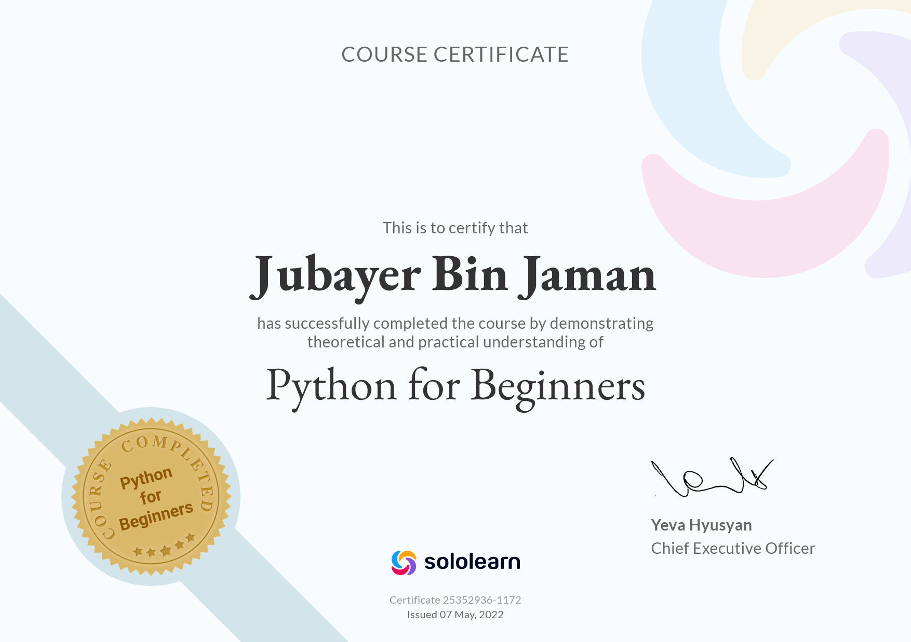

# <a href="https://www.python.org" target="_blank" rel="noreferrer">  Python for Beginners </a>

Python is a popular, easy-to-learn, and very powerful programming language, which is used in software and web development, data science, machine learning, and many other fields. I’ll cover the basic concepts of Python, with codes learn from sololearn. Python for Beginners requires no prior programming experience, so let’s gooo...!

# <a href="https://www.python.org" target="_blank" rel="noreferrer">  Certificates </a>

<a href="https://www.python.org" target="_blank" rel="noreferrer"> 